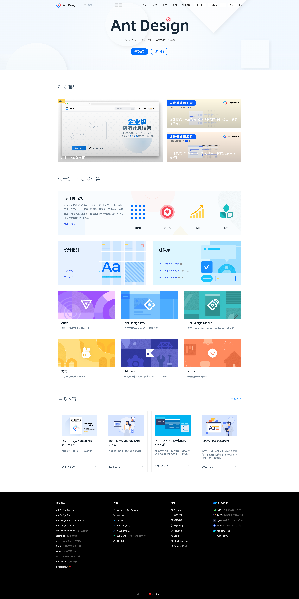
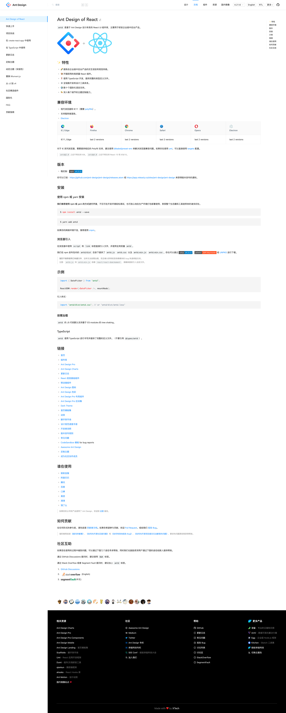
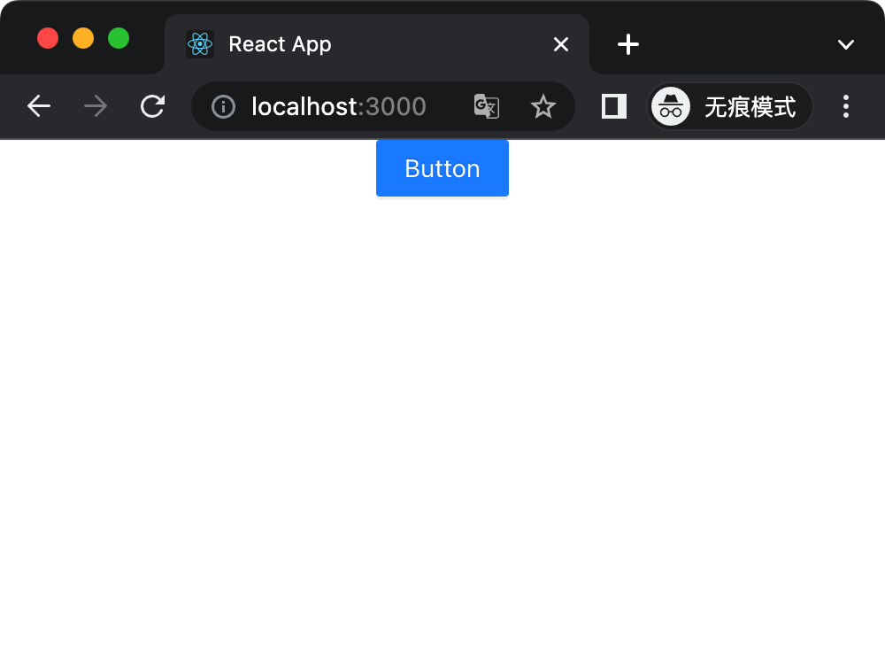
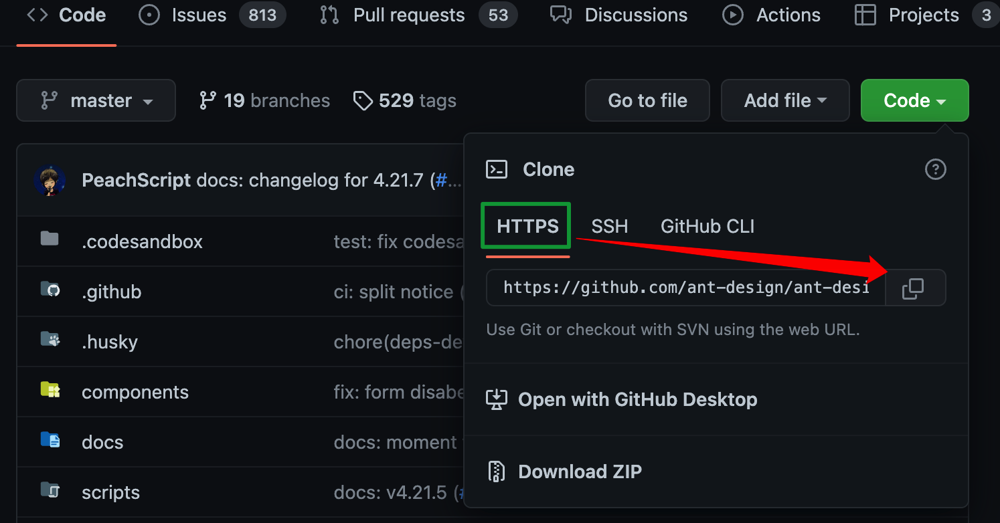
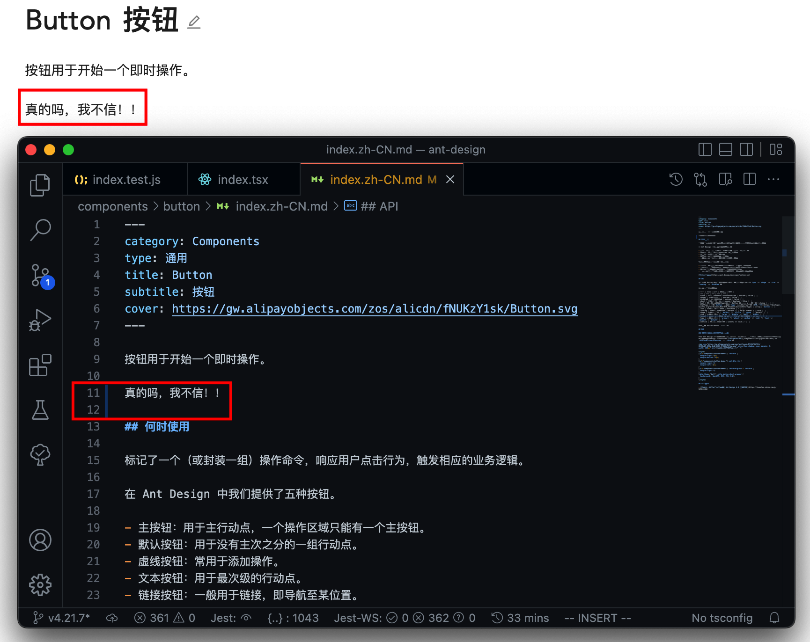

# 导读

github上面有一些很“哇塞”的项目，在工作中呢，我们只是作为“使用者”的角色，去把这些开源项目应用在项目中。
看着官网提供的资料，了解了这是什么、这怎么安装、这怎么使用、这有什么东西……
这很常见，从使用者的角度上看，甚至社区上的项目写得好不好跟我们关系也不大。
“能用就用，不能用就换一个，反正有很多选择”，这是很多人使用者的态度。
这当然没问题。
不过作为研发人员，我们可以不止步于此，可以进一步深入了解他们的项目代码。
毕竟作者都开源了，肯定是希望社区上的用户能对他们的代码有更多的了解。
开源给了所有技术人员一个机会——了解其他优秀开发者的项目机会。
遗憾的是大部分开发者都不具备去独立分析一个开源项目的方法。
看到优秀的项目代码，常常没办法搞懂整体设计、功能代码，想了解其实现也望而止步。

**这是一个系列，以Ant Design UI（react）为示例，一起学习如何分析一个开源项目。**

<!-- more -->

# 通识

从“编译层”的维度看（排序：底层依赖->高层实现），大概分成这几个领域：
1. 机器码
2. 编程语言
3. 语言框架
4. 代码项目
5. 项目依赖
6. 项目插件
7. ……

从项目类型的维度（排序：从难到易）大致可以分为：
1. 编程语言
2. 语言框架
4. 开源软件
5. 框架/类库
6. 框架/类库的插件
7. 业务项目（demo）
8. 文档资料

> 只是粗略的分类，或许你有比我更好的分层方式；而且也不是固定的，比如有些开源项目，本身就是一个语言框架，那他可能就根本没有依赖其他语言框架，所有没有3也是正常的。

**编译层和项目类型可以为我们快速定位一个开源项目的信息，以及是否值得你去分析；
还有难易度，是否自己满足前置技能有分析其代码的能力。**

比如“文档资料”是最没分析价值的，或许是文档的排版格式很漂亮，自己也想搞个很漂亮的文档页面；
那应该得去看这个文档是用什么东西生成的，关注点就应该转移到这个文档生成框架了（“开源软件/框架/类库”）。

虽然我们是以Ant Design——一个ts语言、react框架（这里提前泄漏信息了，在没开始看资料前，应该是不知道这些信息的）的ui库为示例。

比如[Spring Boot](https://github.com/spring-projects/spring-boot)，是用`Java`写的，那么要去分析`Spring Boot`。
前置条件是熟悉`Java`语法，以及对相关领域（网络请求、http、api、数据库操作）有所概念。
而[Django](https://www.djangoproject.com/)是用`Python`的写的，分析前也同样要对相关的编程语言、
以及相关领域（同`Spring Boot`，因为它们都可以用于web开发）有所概念。
甚至是需要确切的用过`Spring Boot`、`Django`开发过项目。
**强烈推荐在分析开源代码前，本身得作为“使用者”使用过这些代码有实际的运用，哪怕是最简单的运用。**

> 所以这是一篇通用性非常强的文章，基本上拿到任何源码项目，都可以按照此文的套路进行粗略分析。

# 初识

> 写过完全没用过and的读者，如果用antd开发过项目，可以选择跳过此章节。从[初窥](#初窥)继续。

- 官方网站：[https://ant.design/index-cn](https://ant.design/index-cn)
- 源码地址：[https://github.com/ant-design/ant-design/](https://github.com/ant-design/ant-design/)

如果之前用过Ant Design，也请忘记掉跟它相关的一切；
现在我们仅有的是的一个源码地址、官方网站而已。

**先了解一下它是什么，能做什么，怎么安装，怎么使用。**

## 浏览官网

先看官网，官网的首页一般都是一些“正确的废话”，很多时候并不能得到有实际作用的信息；
最顶部的菜单：`设计  文档 组件 资源 国内镜像 ……`，这些有很大的信息量，先不看；
最底部的脚页：`相关资源 社区 帮助 更多产品` 四大板块，都是外部链接，也先不看；




 首页有个很明显的“开始使用按钮”，是专门写给使用者的，我们要第一个要看的是这个。



这个页面就有很多有效的信息量了，但是表述还是太过官网，个人理解可以用接地点的方法，稍微提取一些：
1. React UI 组件库（是什么）
2. 用来做中后台产品（能做什么）
3. 开箱即用
4. 用`TypeScript`写的
5. 多语言支持
6. 支持主题定制
7. 最少兼容IE11
8. 支持ssr
9. 也能被Electron使用
10. 用npm、yarn安装 / 浏览器引入 / 按需加载 （什么安装）
11. 【简单示例 - 见上图】(怎么使用)

那么“它是什么，能做什么，怎么安装，怎么使用”，其实都知道了，这个时候也要知道使用antd的一些前置条件：
1. React
2. Typescript/JavaScritpt
3. npm

**这也是antd对使用者的前置技能要求，若是不了解，建议先学好前置技能。**

_`链接、谁在使用、如何贡献、社区互助`：次要信息，不需要关注。_

上图右侧边栏是文档用于文章章节定位；
左侧是导航菜单，看完了此页面（Ant Design of React）就继续往下看；
把整个文档完整看一遍；
可以快速阅读，但不要跳过任何章节。

## 初用

或许在上一章的时候，你已经跟着文档搭建，启动了一个antd的项目；
文档提供了好几种方法（浏览器引入、create-react-app、create-react-app+typescript、umi）。
这里用官网提供的[create-react-app+typescript](https://ant.design/docs/react/use-in-typescript-cn)方式搭建；
_`高级配置` 暂时用不上，跳过。_

一切顺利的话，我们会在localhost:3000看到一个蓝色的按钮。



[项目提交链接](https://github.com/screw-hand/demo-fragment/commit/667ffb13bcc716c16fefdb34247c39eb671ab292)

## 更多的信息

把关注点放到官网的“最顶部的菜单”：`设计 文档 组件 资源 国内镜像 ……`。
其实在[初用](##初用)那一章，我们就已经把“文档”模块给看完了；
`设计 资源 国内镜像 `，这几个点进去一看，
没看到有关的使用信息，还是没必要看；
而`组件`模块，才是antd最核心的教程；


把所有的组件都过一遍，试着在刚才的demo进行一些实例试用。

# 初窥

到目前为止，我们都是以“使用者”的角色去使用一个开源项目。
通过以上的使用经验，我们是时候开始接触源码层面了。

- 源码地址：[https://github.com/ant-design/ant-design/](https://github.com/ant-design/ant-design/)


- 红色：Code、Issuses、Pull requests —— 此代码项目的“代码”、“问题讨论”、“推拉请求”。
- 黄色：master是当前的分支，分支信息（目前有19个分支），标签信息(529个)；
- 绿色：“关于”，项目介绍、官网链接、开源许可协议，start、watch、forks等信息。
- 蓝色：releases信息，开源代码发布正式代码产生的信息。
- 咖啡箭头：Octotree——一个浏览器插件，可树形结构显示Github项目。

**当前查看的代码是默认分支（master，由仓库设置）的代码，想查看其他分支的代码，可以在master那个改变分支名。**

在此页面滚动下来的[README.md](https://github.com/ant-design/ant-design#readme)，是根目录下的`README.md`文件，一般也是些文档资料；
关于文档资料，看中文还是英文的，个人建议是：**原则是看原文的，即——国内项目看中文，国外项目看英文。**

## 获取源码

现在我们要clone源码，点击上图的绿色按钮“Code”，有三种方式Clone代码，最通用的是使用HTTPS方式，红色箭头点击可直接复制url。

*不一定要clone源码到本地，有时候我们只是想简单看看源码的几个文件，并不需要全盘分析整个项目。有三个工具，都可以很方便查阅代码。*

1. [Octotree](https://www.octotree.io/)——下载对应的浏览器插件，简单配置好github auth token，即可在浏览器左侧使用
2. [github1s](https://github.com/conwnet/github1s)——直接在浏览器地址栏github后面加上1s即可：https://github<span style="color:red">1s</span>.com/ant-design/ant-design/
3. [github dev](https://github.com/github/dev)——直接在浏览器地址栏.com换成.dev即可：https://github<span style="color:red">.dev</span>/ant-design/ant-design/




clone下来后，当前的分支(branch)是默认分支，建议是把HEAD切换到最新的release那份代码，这里的最新release是[4.21.7](https://github.com/ant-design/ant-design/releases/tag/4.21.7)。也是此章节蓝框点进去的链接。
**如果是业务项目出问题了，对项目依赖库进行问题排查，建议切换到项目实际使用的版本。**


- 绿：这次的发布是从master发布的
- 红：此次发布的代码标签
- 蓝：此次发布的代码提交id

*antd的源码仓库1G+，实在太大了，如果真的clone不来，可以去release页面，翻到最下面的“Source Code”选择压缩包下载；代价就是失去git管理的信息。*

```shell
> $ git clone https://github.com/ant-design/ant-design.git
Cloning into 'ant-design'...
remote: Enumerating objects: 341830, done.
remote: Counting objects: 100% (892/892), done.
remote: Compressing objects: 100% (626/626), done.
remote: Total 341830 (delta 396), reused 546 (delta 191), pack-reused 340938
Receiving objects: 100% (341830/341830), 937.73 MiB | 3.88 MiB/s, done.
Resolving deltas: 100% (227846/227846), done.

> $ cd ant-design

> $ git reset --hard 10b153f

> $ git checkout -b v4.21.7

```

重置HEAD到最新release的commit，并切出一条新的分支`v4.21.7`

## 版本

软件工程领域中，版本的问题就跟软件名字一样重要，不同的小版本，也会有一些微小的区别，强烈建议版本要完全匹配；
由于官网一般用的是最新发布的文档，所以我们在上一步，获取的是最新release的版本，已经完成了匹配。

这里顺便看看github仓库的分支、tag信息——[Branches · ant-design/ant-design](https://github.com/ant-design/ant-design/branches)


## 根目录分析

现在开始正式分析源码，首先看项目根目录。
根目录有很多东西，这里按照一个比较通用的分类。
对根路径下的目录文件进行简单介绍，先不看文件/目录的具体内容。
文件/目录的命名，一般特定的文件都有约定俗成的名称。

```shell
# 项目工程

## git/github
.git
.github
.gitignore
.gitpod.yml
.husky

## docker
.dockerignore
Dockerfile.ui-test
docker-compose.yml

## 项目配置
.editorconfig
.npmignore
tsconfig.json
webpack.config.js
package.json
renovate.json
index-style-only.js
index-with-locales.js

## 代码格式
.eslintignore
.eslintrc.js
.prettierignore
.prettierrc
.stylelintrc.json

## 测试相关
.jest.image.js
.jest.js
.jest.node.js
.jest.site.js
jest-puppeteer.config.js

## 其他
.codesandbox
.depslintrc.js
.remarkrc.js

# 文档类
AUTHORS.txt
CHANGELOG.en-US.md
CHANGELOG.zh-CN.md
CNAME
CODE_OF_CONDUCT.md
LICENSE
README-ja_JP.md
README-pt_BR.md
README-sp_MX.md
README-uk_UA.md
README-zh_CN.md
SECURITY.md

# 代码入口文件
index.js

# 目录
components
docs
tests
typings
scripts
site
```

我们大概知道了根路径下的这些文件是什么东西，但是还有一小部分不知道，有些东西并不重要，可以忽略之；
比如以上的项目工程->git、github、docker、测试、代码格式相关，对于antd的实现没有太大的关系，不建议细看。

## 项目起点
根目录有两个很重要的文件——`pckage.json`、`index.js`，后者很有可能是整个项目的启动文件，但是我们目前还无法确定，现在就要来验证一下是否为项目的启动文件。

熟悉前端开发的小伙伴应该都明白`package.json`的重要性；
每个现代前端项目，都会有`package.json`；
里面的信息都是项目级别的元信息；
这是最重要的文件了，我愿称之为项目起点文件。

打开常用的编辑器，检阅大致内容，关注以下配置；
- `bin` 命令行相关，引用的文件会被添加到PATH。
-   `scripts` 定义了一组可以运行的 node 脚本。
-   `dependencies` 设置了作为依赖安装的 `npm` 软件包的列表。
-   `devDependencies` 设置了作为开发依赖安装的 `npm` 软件包的列表。

[package.json 指南](http://nodejs.cn/learn/the-package-json-guide)

 `scripts` 中常用`start`、`dev`、server等关键字来启动项目，重点关注这几个字眼；
 `dependencies`、  `devDependencies` 可以知晓项目的一级依赖，大
 概知道其技术栈；

其实当我们看到`package.json`就应该下意识去安装依赖。

```shell
> $ npm i

# 省略掉npm的输出信息

> antd@4.21.7 prepare
> husky install

husky - Git hooks installed

added 3655 packages in 7m
 
```

根目录会出现两个新玩意：
1. `package-lock.json`——此项目的依赖的所有npm包，亦理解为描述node_modules的目录树文件（比`package.json`的`dependencies`更强大，可以在这个文件查看所有、层级依赖）
2. `node_modules`——项目依赖包

# 启动项目

环境信息：
- 操作系统—— macOs v12.4
- node —— v14.19.3
- npm —— v8.12.1

`package.json`中的第93行，"start"中调用了`antd-tools`这个东西，但是我们并不知道这个东西是从哪来的。

```shell
{
  ...
  "script": {
    "start": "antd-tools run clean && cross-env NODE_ENV=development concurrently \"bisheng start -c ./site/bisheng.config.js\"",
  }
  ...
}

```

node的可执行文件，都会放在`node_modules/.bin`下面，所有我们要查看这个目录。

```shell
> $ ls node_modules/.bin
## 太多东西了，省略掉输出信息

> $ ls -l node_modules/.bin | grep 'antd-tools'
antd-tools -> ../@ant-design/tools/bin/antd-tools.js
antd-tools-run -> ../@ant-design/tools/bin/antd-tools-run.js
# node_modules/.bin/antd-tools是一个软链接，指向 node_modules/@ant-design/tools/bin/antd-tools.js

> $ cat node_modules/@ant-design/tools/package.json
{
  "name": "@ant-design/tools",
  ...
  "homepage": "http://github.com/ant-design/antd-tools",
  ...
  "bin": {
    "antd-tools": "./bin/antd-tools.js",
    "antd-tools-run": "./bin/antd-tools-run.js"
  }
  ...
}
```

通过`node_modules/@ant-design/tools/package.json`，我们得知了：
- `antd-tools`这个命令是由"@ant-design/tools"提供的
- "@ant-design/tools"还提供了`antd-tools-run`命令行
- 首页[http://github.com/ant-design/antd-tools](http://github.com/ant-design/antd-tools)

*点开"homepage"，就是能看到@ant-design/tools的源码了；如果去分析其代码实现，我们的关注点就变了，所以这里建议看完README.md等一些文档资料马上关闭掉这个网页。*

package的script=>start配置很长，我们需要分成几个部分看看：
1. antd-tools run clean
2. cross-env NODE_ENV=development
3. concurrently
4. bisheng start -c ./site/bisheng.config.js

还是用刚才的方法，从`node_modules/.bin`查看命令行由哪个依赖包提供，查看依赖包的`package.json`，从`homepage`找到一些资料，关于这个依赖包的说明。

当然，知道了包名（`node_modes`下的目录都是包名）也可以直接去[npm官网](https://www.npmjs.com/)查找这个包的资料。
如`node_moudles/@ant-design/tools/` => [https://www.npmjs.com/package/@ant-design/tools](https://www.npmjs.com/package/@ant-design/tools)

```shell
> $ ll node_modules/.bin | grep -E 'antd-tools | cross-env | concurrently | bisheng' 

antd-tools -> ../@ant-design/tools/bin/antd-tools.js
bisheng -> ../bisheng/bin/bisheng
concurrently -> ../concurrently/dist/bin/concurrently.js
cross-env -> ../cross-env/src/bin/cross-env.js
```

结论是：
1. antd-tools —— 专门为antd开发的cli工具
2. bisheng —— 将Mardown转换成用React构建的静态网站
3. concurrently —— 同时运行多个命令
4. cross-env —— 跨平台设置环境变量

所以一条简单的`npm start`，至少使用了4个依赖包……
那就先启动项目吧。

Antd官网的贡献指南- [开发流程](https://ant.design/docs/react/contributing-cn#%E5%BC%80%E5%8F%91%E6%B5%81%E7%A8%8B)章节也有对重要script命令简单介绍。

```shell
> $ npm start

> antd@4.21.7 prestart
> npm run version


> antd@4.21.7 version
> node ./scripts/generate-version


> antd@4.21.7 start
> antd-tools run clean && cross-env NODE_ENV=development concurrently "bisheng start -c ./site/bisheng.config.js"

antd-tools run clean
[0] ℹ Compiling 🚚  Bisheng
[0] ℹ ｢wds｣: Project is running at http://localhost:8001/
[0] ℹ ｢wds｣: webpack output is served from undefined
[0] ℹ ｢wds｣: Content not from webpack is served from /Users/wu/Documents/code/ant-design/_site
[0] ℹ ｢wds｣: 404s will fallback to /index.html
[0] ✔ 🚚  Bisheng: Compiled successfully in 55.77s
[0]  DONE  Compiled successfully in 55766ms11:51:08 AM
[0] 
[0]  WAIT  Compiling...11:51:09 AM
[0] 
[0] ℹ Compiling 🚚  Bisheng
[0] ✔ 🚚  Bisheng: Compiled successfully in 801.56ms
[0]  DONE  Compiled successfully in 804ms11:51:11 AM
[0] 

```

**以上的输出信息都比较重要，建议自行翻译理解。**

两次“DONE”之后，浏览器上http://localhost:8001/就能看到启动的官网。
**所以npm start其实是启动了一个官网项目的网站。**
这个官网由bisheng（毕升）驱动的，bisheng的指定了配置文件。
`site/bisheng.config.js`，`npm start`使用了这个配置文件；
我们也应该打开看看，[35～41行](https://github.com/ant-design/ant-design/blob/10b153f65de6eb5a18107a3c88db18c8aaeade07/site/bisheng.config.js#)有`source`的配置；
得去bisheng的REAMD.md看看有没有关于配置文件`source`的资料;
[source](https://github.com/benjycui/bisheng#source-string--arraystring--object-category-string--arraystring)是存放Markdown文件的配置，官网提供的是字符串例子；
可是antd却使用了对象方式去配置，遗憾的是没找到对象配置的例子。
不再研究bisheng的配置，继续看bisheng的配置文件；

```shell
  source: {
    components: './components',
    docs: './docs',
    changelog: ['CHANGELOG.zh-CN.md', 'CHANGELOG.en-US.md'],
    'components/form/v3': ['components/form/v3.zh-CN.md', 'components/form/v3.en-US.md'],
    'docs/resources': ['./docs/resources.zh-CN.md', './docs/resources.en-US.md'],
  }
```

changelog、'components/form/v3'、'docs/resources'，都是配置的是MarkDown文件路径，
都扫一眼，发现没啥特殊是，只是网站组成的页面一部分；
docs/components都是目录，先看看目录有什么东西；

```shell
> $ ls docs/ components/

components:
## 省略输出

docs/:
react              resources.en-US.md resources.zh-CN.md spec
```

components下有个我们熟悉的`index.tsx`，[components/index.tsx](https://github.com/ant-design/ant-design/blob/10b153f65d/acomponents/index.tsx)
这个模块导出了很多组件，组件名都能跟官网的[组件总览](http://localhost:8001/components/overview-cn/)一一对应
可以得知这个文件时组件的入口文件；
我们用最简单的`Button`示例， [http://localhost:8001/components/button-cn/](http://localhost:8001/components/button-cn/)
这个页面有“按钮用于开始一个即时操作。”的文本，用vscode全局搜索，得知这段话来源于——
[components/button/index.zh-CN.md](https://github.com/ant-design/ant-design/blob/10b153f65d/components/button/index.zh-CN.md) ，试着修改这段文本，在本地的官网项目查看效果。



然而页面下面的“代码演示”的源码内容并没有包含在此文件里；
通过bisheng的主题配置去找“生成规则”太浪费时间了（还是得注意我们的关注点在antd，其他都不关注）；
用VScode搜索`Primary Button`字段，尝试修改[components/button/demo/basic.md](https://github.com/ant-design/ant-design/blob/10b153f65d/components/button/demo/basic.md)


小结：
1. [components/index.tsx](https://github.com/ant-design/ant-design/blob/10b153f65d/acomponents/index.tsx) 组件的总入口文件
2. `components/[name]` 一个目录对应一个组件
3. `components/[name]/index.tsx` 组件模块级别的入口文件，导出组件级别模块
4. `components/[name]/index.zh-CN.md` 组件页面入口文件
5. `components/[name]/demo` 组件页面入口“代码示例”

## 调试代码

1. console.log
2. 浏览器断点调试
3. 源码断点调试

[React JavaScript Tutorial in Visual Studio Code](https://code.visualstudio.com/docs/nodejs/reactjs-tutorial#_debugging-react)

## 包别名

[npm-link | npm Docs](https://docs.npmjs.com/cli/v6/commands/npm-link)

# 体系家族

Ant Desigin有很庞大的体系，通过之前的阅读源码我们触及到了其体系下的多个npm包——“@ant-design/tools”、`rc-\*`组件，还有官网footer下的一些相关资源推荐。

- [Ant Design Charts](https://charts.ant.design/)
- [Ant Design Pro](https://pro.ant.design/)
- [Ant Design Pro Components](https://procomponents.ant.design/)
- [Ant Design Mobile](https://mobile.ant.design/)
- [Ant Design Landing](https://landing.ant.design/)
- [Awesome Ant Design](https://github.com/websemantics/awesome-ant-design)

[Ant Design Team · GitHub](https://github.com/ant-design)

# 初心

分析开源项目是一件比较费时费力的事情，我们在开始分析代码前，最好确定一下为什么要分析源码，以及真的有必要吗。
- 学习优秀的同类项目
- 使用开源项目过程中报错，定位bug是否在此项目
- 技术调研（成本偏高）
