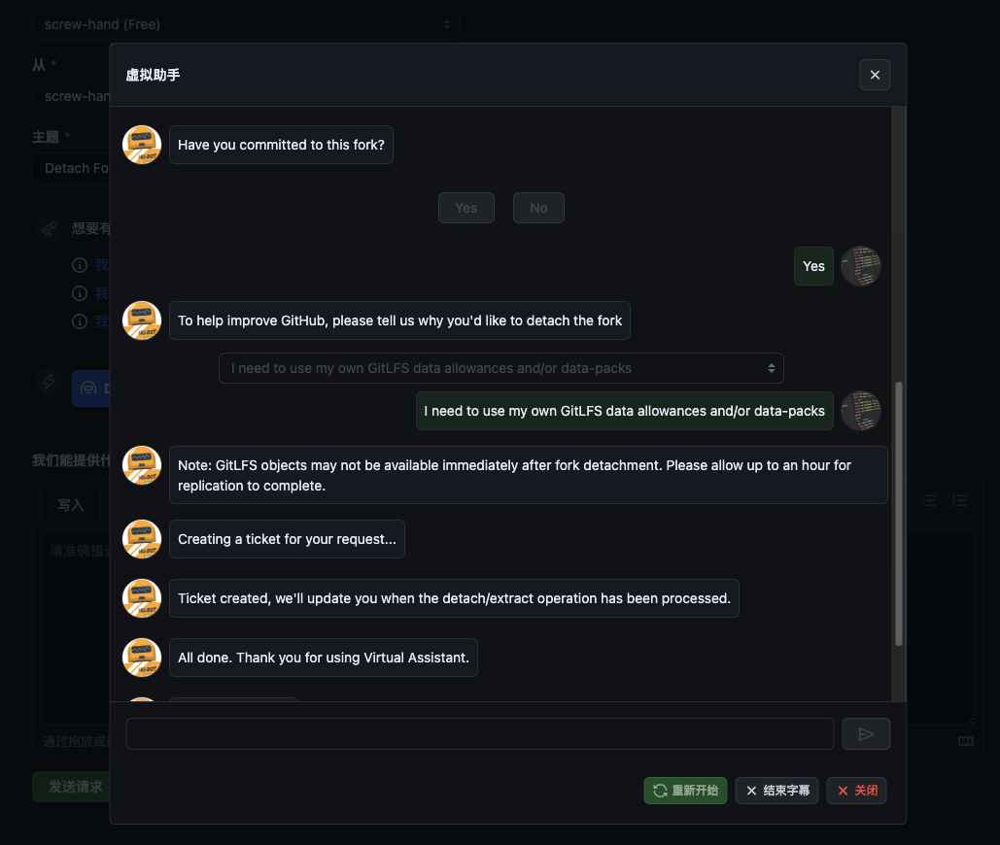
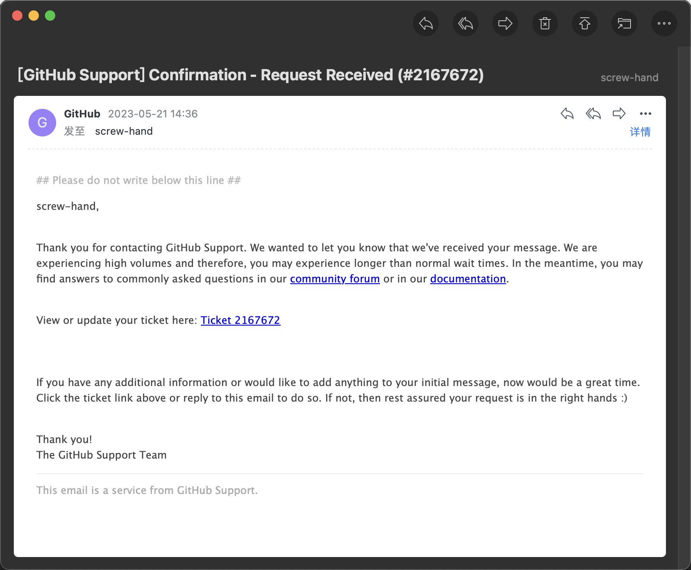

## 前言

进阶fork技巧，对初学者不是那么友好，建议拥有以下前置技能：

1. 使用过github的fork/pr操作
2. 熟悉使用git命令的多个分支，多个远端操作
3. 熟练使用git处理合并分支冲突

各个大标题内容独立，可根据自己需求跳读:

- 如何将fork类型仓库转成自己的仓库
- 如何同步多个上游仓库
- 在fork之前clone上游仓库并commit了，怎么提pr

<!-- more -->

## 如何将fork类型仓库转成自己的仓库

有什么好处？

- 可以将其设置成私有仓库：fork类型的仓库无法设置成私有仓库
- 不打算提pr到上游仓库，并且想要有github的contributions（俗称：绿点/绿墙）：fork类型的仓库，就算提交到了主分支，也不会有contributions.

**使用github support的分离复刻。**

[Forks - GitHub 支持](https://support.github.com/request/fork)




自动弹出这个对话框，执行以下操作：
- 选择Detach/Extract
- 输入`owner/repository-name`
- 选择`Yes` (committed to this fork) 、选`No`会让你自己手动复刻一遍
- 选择`I need to use my own GitLFS data allowances and/or data-packs`

等待邮件。

上图我选择了[screw-hand/layui](https://github.com/screw-hand/layui)，作为例子。
其实之前我已经用过一次了，这是[screw-hand/github-profile-trophy](https://github.com/screw-hand/github-profile-trophy)的邮箱通知：




转成自己的仓库，github官方需要时间去处理， 可以参考一下两封邮箱的相差时间。


刚才选`No`的结果：


## 如何同步多个上游仓库

### 一个上游仓库

来，[Syncing a fork - GitHub Docs](https://docs.github.com/en/pull-requests/collaborating-with-pull-requests/working-with-forks/syncing-a-fork), 这里有教我们fork后的repo，如何与上游的repo保持同步。
但是只教我们同步一个，如果我们自己的repo是一个N合1（缝合怪），需要跟多个上游仓库保持同步。就需要再执行一些操作了。

### 多个上游仓库

比如我的[screw-hand/github-profile-trophy](https://github.com/screw-hand/github-profile-trophy)，就有两个上游：

```shell
https://github.com/ryo-ma/github-profile-trophy.git       # upstream
https://github.com/lucthienphong1120/github-trophies.git  # super-upstream
```

一个叫`upstream`，一个叫`super-upstream`，你喜欢叫其他的也行，就跟`origin`一样，这只是git的远端名称。

*我的[screw-hand/github-profile-trophy](https://github.com/screw-hand/github-profile-trophy)经过上文的github support操作，已经不是fork的仓库了。不过以下操作，跟是否为fork类型的仓库无关，你可以假设此仓库还是fork类型的。但是跟commit tree有关，待会我们会遇到的。*

接下来的操作，你可以直接复制到你的命令行，随便拿我的[screw-hand/github-profile-trophy](https://github.com/screw-hand/github-profile-trophy)去玩吧。
反正你push不了，哈哈。

**本质上，同步多个上游仓库是用git命令行去添加多个remote，然后对remote branch进行合并的操作。**

以下的命令是同步一个上游仓库，如果你对命令行多个远端操作比较熟悉，可以快速预览甚至跳过。

```shell
# 1. 我们已经有一个fork仓库，clone到本地
git clone https://github.com/screw-hand/github-profile-trophy.git
cd github-profile-trophy

# 2. 检查远端分支，现在只有一个orgin，指向你自己的仓库（fork仓库）
git remote -v

# origin	https://github.com/screw-hand/github-profile-trophy.git (fetch)
# origin	https://github.com/screw-hand/github-profile-trophy.git (push)

# 3. 回到当前分支的第一个commit
# 注:为了示例,让下面第7步有输出,特意回退了提交
#    实际情况不需要回退,但如果上游仓库没新提交
#    将是:`Already up to date.`
git reset $(git rev-list --max-parents=0 HEAD) --hard

# HEAD is now at 5a9cbef first commit

# 4. 添加多个远端仓库，分别为: upstream, super-upstream
git remote add upstream https://github.com/ryo-ma/github-profile-trophy.git
git remote add super-upstream https://github.com/lucthienphong1120/github-trophies.git

# 5. 检查远端仓库是否成功设置,将有3个远端仓库
git remote -v

# origin	https://github.com/screw-hand/github-profile-trophy.git (fetch)
# origin	https://github.com/screw-hand/github-profile-trophy.git (push)
# super-upstream  https://github.com/lucthienphong1120/github-trophies.git (fetch)
# super-upstream  https://github.com/lucthienphong1120/github-trophies.git (push)
# upstream        https://github.com/ryo-ma/github-profile-trophy.git (fetch)
# upstream        https://github.com/ryo-ma/github-profile-trophy.git (push)

# 6. 更新远端仓库的所有信息（分支、标签）
git fetch --all

# Fetching origin
# Fetching upstream
# From https://github.com/ryo-ma/github-profile-trophy
#  * [new branch]      VegaDeftwing-master        -> upstream/VegaDeftwing-master
#  * [new branch]      juicyfresh                 -> upstream/juicyfresh
#  * [new branch]      master                     -> upstream/master
#  * [new branch]      pr-125                     -> upstream/pr-125
#  * [new branch]      radical                    -> upstream/radical
#  * [new branch]      spenserblack-theme/dracula -> upstream/spenserblack-theme/dracula
# Fetching super-upstream
# From https://github.com/lucthienphong1120/github-trophies
#  * [new branch]      main       -> super-upstream/main

# 7. 执行远端合并, `git fech --all`，你可以看到remote upstream的默认分支是master
# 如果不知道怎么找默认分支，去github repo web找：https://github.com/ryo-ma/github-profile-trophy
# github repo web当前的分支就是默认分支
git merge upstream/master

# 省略输出，此刻成功合并`upstream/master`的所有内容，无冲突
```


到这里为止，其实我们的操作跟[Syncing a fork branch from the command line](https://docs.github.com/en/pull-requests/collaborating-with-pull-requests/working-with-forks/syncing-a-fork#syncing-a-fork-branch-from-the-command-line)是完全一样的。但我们合并第二个远端分支，问题就来了。

### 多个上游仓库的特殊处理

```shell
# 执行第二个远端分支合并，`git merge super-upstream/main`会成功吗？
git merge super-upstream/main
# fatal: refusing to merge unrelated histories
# why ??
```

因为git觉得`super-upstream/main`跟我们现在的`origin/master`的分支毫无相干，你可以理解为没有一致的“commit tree”。
但是我们为什么可以执行`git merge upstream/master`呢？因为`origin`就是fork了`upsteam`的remote而来的。所以我们刚直接merge是有一定概率毫无冲突的。

通过[stackoverflow](https://stackoverflow.com/a/40107973)的帮助，我们继续执行。

```shell
git pull super-upstream main --allow-unrelated-histories
# From https://github.com/lucthienphong1120/github-trophies
#  * branch            main       -> FETCH_HEAD
# hint: You have divergent branches and need to specify how to reconcile them.
# hint: You can do so by running one of the following commands sometime before
# hint: your next pull:
# hint:
# hint:   git config pull.rebase false  # merge
# hint:   git config pull.rebase true   # rebase
# hint:   git config pull.ff only       # fast-forward only
# hint:
# hint: You can replace "git config" with "git config --global" to set a default
# hint: preference for all repositories. You can also pass --rebase, --no-rebase,
# hint: or --ff-only on the command line to override the configured default per
# hint: invocation.
# fatal: Need to specify how to reconcile divergent branches.

# 出现这个是因为没有配置git如何处理冲突，建议使用`merge`,不建议配置成全局
git config pull.rebase false

# 再次执行`git pull super-upstream main --allow-unrelated-histories`
# 现在是
# From https://github.com/lucthienphong1120/github-trophies
#  * branch            main       -> FETCH_HEAD
# Auto-merging LICENSE
# CONFLICT (add/add): Merge conflict in LICENSE
# Auto-merging README.md
# CONFLICT (add/add): Merge conflict in README.md
# Auto-merging index.ts
# CONFLICT (add/add): Merge conflict in index.ts
# Auto-merging src/card.ts
# CONFLICT (add/add): Merge conflict in src/card.ts
# Auto-merging src/github_api_client.ts
# CONFLICT (add/add): Merge conflict in src/github_api_client.ts
# Auto-merging src/theme.ts
# CONFLICT (add/add): Merge conflict in src/theme.ts
# Auto-merging src/trophy.ts
# CONFLICT (add/add): Merge conflict in src/trophy.ts
# Auto-merging src/trophy_list.ts
# CONFLICT (add/add): Merge conflict in src/trophy_list.ts
# Auto-merging src/user_info.ts
# CONFLICT (add/add): Merge conflict in src/user_info.ts
# Auto-merging src/utils.ts
# CONFLICT (add/add): Merge conflict in src/utils.ts
# Automatic merge failed; fix conflicts and then commit the result.
```

好了，现在已经是合并中的状态了，剩下的就是处理文件冲突了。就像我们平时一样：
- 查看文件改动历史，比较差异
- 根据自己需要，调整文件
- 测试代码
- `git add .`
- `git commit -m XXX`
- `git push`

为了节约时间，我不处理文件冲突，直接提交到`origin/fork-example`。
**因为这是个示范，这些事情我之前做过了，任何时候都不建议将未处理的冲突文件提交！！**

```shell
git add .
git commit -m "chore: new branch of fork-exapmle"
git checkout -b fork-exapmle
git push --set-upstream origin fork-exapmle
```

[commit log - fork-example](https://github.com/screw-hand/github-profile-trophy/commits/fork-exapmle)


### 跟踪多个上游仓库的更新

至此第一次同步多个上游仓库就结束了。后续如果想继续跟踪远端上游的变动并且合并，也是大概这样的思路。

```shell
# 1. 获取远端信息，如果有新的变动，此次终端会输出信息
git fetch --all
# 2. 合并fork的上游，此时大概率需要解决冲突
git merget upstream
# 3. 合并非fork的上游，仍然需要注意冲突
git pull super-upstream main --allow-unrelated-histories
```

### 记录上游仓库信息

**建议把remote的信息记录在repo的`REAME.md`!!**  [README.md - Init Project](https://github.com/screw-hand/github-profile-trophy#init-project)
因为现在的仓库已经不是fork类型的，跟上游完全切断了联系，如果不记录的话。
后续更换开发设备，或者意外删除本地的git仓库，将会**完全失去与上游的联系！**


### 实例，为什么要同步多个上游仓库

为什么我的github-profile-trophy需要同步两个上游仓库呢？

- upsteam 两年内一直在更新
- super-upsteam 有upsteam没有的新功能，但是两年没更新了
- 我也需要对其做一些定制化开发

所以将两个上游仓库一起跟踪合并是最好的。

如果对这个[github-profile-trophy](https://github.com/screw-hand/github-profile-trophy)感兴趣，你也可以将下面的两个链接添加到你的github profile page，别忘了将`screw-hand`换成自己的github username。

```
# 过滤掉指定等级(UNKNOWN，C)的奖杯
https://github-profile-trophy.screw-hand.vercel.app/?username=screw-hand&rank=-UNKNOWN,-C

# 只展示所有秘密奖杯，并且全部无条件获得
https://github-profile-trophy.screw-hand.vercel.app/?username=screw-hand&rank=SECRET&wantAll=true
```

## 在fork之前clone上游仓库并commit了，怎么提pr

可能大多数人都是有了pr的想法，就第一时间fork仓库。我更喜欢clone上游仓库到本地。
为什么要先clone上游仓库到本地呢？有时候我们只是想随意看看其他人的代码，跑一跑。
然后发现一些地方可以新增功能，修复bug，我们本来没有提pr的意思，现在代码也改了。
也不想再去fork之后，再cc cv代码到新的fork repo。
当然github也可以在线浏览代码，clone到本地的话，除了看代码，也可以直接把项目先跑起来，改着玩玩。
这时候也可以直接修改代码然后commit，只是因为远端的仓库我们没有权限无法push。

还有一种情况是： 如果一开始就是冲着提pr，先fork了，改不动代码了，这时候除了删本地的文件夹，还需要在删掉github的fork仓库。

比如我们想给[haozi/New-Bing-Anywhere](https://github.com/haozi/New-Bing-Anywhere)提一个pr。

```shell
# 1. clone上游仓库到本地
git clone https://github.com/haozi/New-Bing-Anywhere.git
cd New-Bing-Anywhere

# 2. 浏览代码 / 启动项目 / 更改代码 / commit
touch pr-file
git add .
git commit -m "feat: pr-file"

# 3. 直接push
git push
# 因为没有仓库的权限，无法直接push到haozi/New-Bing-Anywhere
# fatal: Authentication failed for 'https://github.com/haozi/New-Bing-Anywhere.git/'
```

这个时候，我们再来fork也不迟，所以我们先到github执行fork操作，得到[screw-hand/New-Bing-Anywhere](https://github.com/screw-hand/New-Bing-Anywhere)

```shell
# 1. 查看远端
git remote -v
# origin	https://github.com/haozi/New-Bing-Anywhere.git (fetch)
# origin	https://github.com/haozi/New-Bing-Anywhere.git (push)

# 2. 将origin换成upstream
git remote rename origin upstream

# 3. 添加fork后的remote为origin
git remote add origin https://github.com/screw-hand/New-Bing-Anywhere.git

# 4.检查远端
git remote -v
# origin	https://github.com/screw-hand/New-Bing-Anywhere.git (fetch)
# origin	https://github.com/screw-hand/New-Bing-Anywhere.git (push)
# upstream	https://github.com/haozi/New-Bing-Anywhere.git (fetch)
# upstream	https://github.com/haozi/New-Bing-Anywhere.git (push)

# 5. 获取远端分支
git fetch --all
```

接下来pr的常规流程：
- 切分支
- commit
- push
- pr

```shell
# 1. 检出新分支
git checkout -b pr-example

# 2. 推送到指定分支
git push --set-upstream origin pr-example

# 3. 删除之前commit的main分支
git branch -D main

# 4. 恢复main分支到未commit的状态
git checkout -b main origin/main

```

[pr-example](https://github.com/screw-hand/New-Bing-Anywhere/commits/pr-example)

这一顿操作下来，会比第一时间fork更麻烦，可以当做没fork之后的补救措施吧。

## clone上游仓库后，创建自己的repo

这是一种比
[如何将fork类型仓库转成自己的仓库](#如何将fork类型仓库转成自己的仓库)、[#fork之前clone上游仓库并commit了，怎么提pr](#在fork之前clone上游仓库并commit了，怎么提pr)更简单的操作方式，效果是一样的。

先clone想要的[上游仓库](https://github.com/snyk-snippets/modern-npm-package],然后在github[创建自己的新repo](https://github.com/new)。
我觉得用[GitHub CLI](https://cli.github.com/)速度更快更方便，以下实例我用会GitHub CLI，跟在github web上操作是等效的。

以下origin的github username，你需要换成自己的。

1. 设计我们的远端仓库

```
https://github.com/snyk-snippets/modern-npm-package.git # upsteam
https://github.com/screw-hand/modern-npm-package.git # origin
```

2. clone上游仓库

```shell
git clone https://github.com/snyk-snippets/modern-npm-package.git
```

3. \*此刻你**或许**会在这里提交代码，但是你无法推送到别人的远端(snyk-snippets/modern-npm-package)

4. 更名远端仓库origin(snyk-snippets/modern-npm-package)为upsteam(snyk-snippets/modern-npm-package)

```shell
git remote -v
# origin https://github.com/snyk-snippets/modern-npm-package.git (fetch)
# origin https://github.com/snyk-snippets/modern-npm-package.git (push)

git remote rename origin upsteam

git remote -v
# upsteam	https://github.com/snyk-snippets/modern-npm-package.git (fetch)
# upsteam	https://github.com/snyk-snippets/modern-npm-package.git (push)
```

5. 使用[GitHub CLI](https://cli.github.com/)创建一个新repo

```shell
gh repo new

? What would you like to do? Push an existing local repository to GitHub
? Path to local repository .
? Repository name modern-npm-package
? Description fork from [snyk-snippets/modern-npm-package](https://github.com/snyk-snippets/modern-npm-package)
? Visibility Public
✓ Created repository screw-hand/modern-npm-package on GitHub
? Add a remote? Yes
? What should the new remote be called? origin
✓ Added remote git@github.com:screw-hand/modern-npm-package.git
? Would you like to push commits from the current branch to "origin"? Yes
Enumerating objects: 77, done.
Counting objects: 100% (77/77), done.
Delta compression using up to 8 threads
Compressing objects: 100% (40/40), done.
Writing objects: 100% (77/77), 117.86 KiB | 458.00 KiB/s, done.
Total 77 (delta 33), reused 67 (delta 27), pack-reused 0
remote: Resolving deltas: 100% (33/33), done.
To github.com:screw-hand/modern-npm-package.git
 * [new branch]      HEAD -> main
branch 'main' set up to track 'origin/main'.
✓ Pushed commits to git@github.com:screw-hand/modern-npm-package.git
```

操作很简单，第一次选项选择`Push an existing local repository to GitHub`，一路回车即可。
`Description`看你，复制upsteam的也行，我这里自己写了。
其他选项是关于仓库的可见性、是否添加远端、添加远端后是否要push。

跟在github web的操作其实是一样的，只是`GitHub CLI`的引导选项很方便。

6. 再次检查远端仓库

```shell
git remote -v
origin	git@github.com:screw-hand/modern-npm-package.git (fetch)
origin	git@github.com:screw-hand/modern-npm-package.git (push)
upsteam	https://github.com/snyk-snippets/modern-npm-package.git (fetch)
upsteam	https://github.com/snyk-snippets/modern-npm-package.git (push)
```

7. 查看github web

[https://github.com/screw-hand/modern-npm-package](https://github.com/screw-hand/modern-npm-package)


## 结尾

为什么有时候提交了没contributions/绿点/绿墙： [Why are my contributions not showing up on my profile? - GitHub Docs](https://docs.github.com/en/account-and-profile/setting-up-and-managing-your-github-profile/managing-contribution-settings-on-your-profile/why-are-my-contributions-not-showing-up-on-my-profile)

...