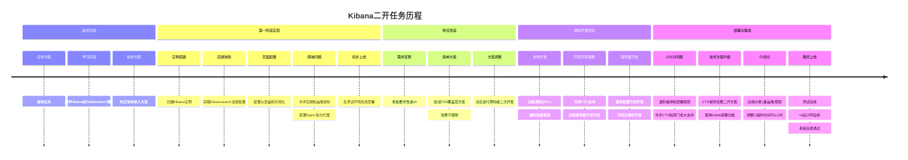

## 前言

这只是一次经历分享，大家当故事听听就行，知识密度不会那么高。
不是kibana、elasticsearch的技术教程，是一个以技术主题的职场故事。
这个任务给我的印象实在是深，是技能面和人力调度最广的一次。
几年前的事情了，有些细节可能有所偏差，错误之处还请指出。

<!-- more -->

## 背景

2021年，我是工龄2.5年的前端开发，公司卖网络安全产品给其他公司客户。彼时已经是第二条产品线了，前端还是做后台管理web(react+umi)。
基层研发团队完整，高级研发人员有：创始人（老板，架构师级别），技术总监(公司技术天花板)，部门老大（团队负责人，网络安全专家）。
公司有自己维护的机房，使用VMware vSphere虚拟化技术灵活分配服务器系统资源，给整个研发团队使用，由运维同事管理。
至少3个项目环境：开发、测试、生产。

那天，PM(产品经理)找我：我们要把kibana的界面，嵌入到我们的后台管理。

我：...（短暂的思考） 为啥？ 意义是什么？ 谁做的技术选型？

PM: 老板决定的，因为我们现在的产品数据读写性能太差了，数据库要换成elasticsearch；然后老板也不希望前端再自己手动写界面，直接用kibana的界面就行了。

内心os：从要解决的痛点分析，kibana 不一定是一个好的方案，但这是老板的决定，我似乎没办法拿出一个更好的方案。我可以做，但效益不一定有预期那么好。

## 起步

好的，任务明确，部门前端两个，我自己工龄不如同事高，他做事情比较稳，但我更喜欢研究折腾玩一些新玩意。我愿意做这个任务，跟同事简单讨论，他表示ok。
开干呗，但我不知道啥是kibana、elasticsearch，肯定得先查资料，看文档，先简单了解一下。

```
Kibana 是一个强大的数据分析和可视化工具，它允许用户通过 ES|QL 进行数据查询和分析，支持多种数据源和类型，提供了一系列的特性和工具来加速数据洞察、解决问题、监控系统、进行安全检查以及提升搜索引活性。
---
Elasticsearch 是一个开源的分布式 RESTful 搜索和分析引擎，它不仅是 Elastic Stack 的核心，而且是一个高性能数据存储和向量基数据库，能够满足各种使用场景的需求，包括 AI 搜索和分析。
```

emm... 要我自己讲，kibana是运维日志面板工具，可以展示来自Elasticsearch的数据；Elasticsearch是一个快速搜数据的引擎，类似数据库能存存储和查询数据。

叠甲：这是一个简单粗暴的理解，对于陌生的概念工具，这样理解可以快速上手。

**预期实现效果：自家产品的后台管理web，嵌入kibana页面，kibana是连接了Elasticsearch实例。**

方向也明确，嵌入可以用html的`iframe`技术；但kibana页面，需要其服务实例，我可以看文档资料，自己搭起来；
如何连接Elasticsearch实例，这需要跟后端要一下，但我也最好提供配置文件，需要啥值让后端直接告诉我，这样他们比较省事。

跟PM，部门老大沟通了一下，这个任务没那么简单，我不好预估时间，而且这些都是新概念，我需要一些时间成本学习。而且个人认为，就算实现了老板的想法，效果不一定有老板预期那么理想。
但老板在公司有完全的决策权，我不会反驳他。还是会按照他的想法，去推动任务。你知道这个风险还有我的意见就行。

PM:放心去做就行。

能行，开搞。

## 创建实例

[Install Kibana with Docker](https://www.elastic.co/guide/en/kibana/7.17/docker.html#run-kibana-on-docker-for-dev)

我玩过服务器还有docker，跑个kibana实例并不难。直接在产品的测试环境服务器（虚拟机）执行吧。预估我后面的操作，都是可以撤回且不影响产品的测试环境。
连接Elasticsearch实例，需要配置`ELASTICSEARCH_HOSTS`的值，直接带着文档资料， 找后端同事让其提供就行。

就这样顺利有了kibana实例，也连接了Elasticsearch实例。工作电脑能访问产品的测试环境。


歪头... 我搞这个实例，是需要搞页面，嵌入到自家产品的后台管理web。
但我现在得到了一个管理平台。如果老板的选型没问题，我应该是可以借助管理平台，配置出页面。
老板既然这么提了，估计是已经看过实际案例，我不需要质疑他，继续往下推动就完事。

## 配置页面

继续翻文档，了解kibana的概念，得出我需要的"零件"，组装成页面：
- 配置索引模式（Index Pattern）
- 使用 Discover 查看数据
- 创建可视化图表（Visualizations）
- 创建仪表板（Dashboard）
- 构建仪表盘（Dashboard）

[visualize-and-analyze](https://www.elastic.co/guide/en/kibana/7.17/introduction.html#visualize-and-analyze)

所以，可视化图表（Visualizations）就是页面的组成元素，仪表盘（Dashboard）就是页面。

[share-a-direct-link](https://www.elastic.co/guide/en/kibana/7.17/reporting-getting-started.html#share-a-direct-link)

Dashboard可以用链接的方式分享，这是**这次任务需要的kibana页面**。

我已经掌握配置kibana的页面了，现在需要回归需求文档，看看需要我配置出具体如何的kibana页面，展示什么数据。
然后用iframe引用dashboard的链接，嵌入到自家产品的后台管理web就行了。

（此处省略一些我了解Elasticsearch的细节，还有产品项目的具体的业务index pattern。 也花费了不少时间，需要找后端了解我页面上的xx模块，这里的数据从哪个index pattern获取）

配置出页面后，iframe嵌入也是小问题，没啥好讲的。隐约记得有跨域问题，我改过前端nginx的配置，为kibana配置了反向代理，当然请求了后端、运维同事的协助。他们在这块比较专业。

```nginx
location /kibana {
    proxy_pass http://192.168.1.100:5601;
    proxy_set_header Host $host;
    proxy_set_header X-Real-IP $remote_addr;
    proxy_set_header X-Forwarded-For $proxy_add_x_forwarded_for;
}
```

至此开发任务到这里收尾，找PM验收，然后上线就是把测试环境的东西，搬到生产环境，就完成上线了。

## 样式改造

PM（产品经理）：老板说，我们的kibana页面太丑了。
我：额... 那要怎么调整。
PM：ui已经设计好了，你按照这个设计稿调整就行。
我：（打开设计稿链接，沉思了一小会...）

**要改外部的url的样式，要么在自家产品页面，叠个样式层，直接覆盖；kibana是开源的，要么在kibana的源码上改，然后重新打包。**

内心OS：前者技术成本小，但支持度可能有限，而且kibana在iframe中，自家产品的样式层，可能无法影响到kibana的样式；
后者技术成本大，但有了源码，我可以自由更改，做任何样式调整。

我：改吧。我想办法。

PM:加油。😉

我更倾向用第一种方案，方便快速。但可能没办法完全还原设计稿。第二种方案，成本高，但样式肯定能还原。
优先用第一种方案，看老板的反馈，如果不行，就只能用第二种方案了。

花了两三天时间，改了自家产品的样式，但效果不理想，PM反馈老板说还是丑。

## 二次开发

没办法了，只能去碰kibana的源码了。虽然我并不想这么做。还是跟PM，部门老大讲我的技术方案，风险告知...

PM、部门老大：继续加油。😉

**写到这里，才重头戏的开始，从这里开始各卡壳，上一个问题解决了，又一直出现新的问题。**

**拉repo源码，本地跑起来，改代码，打包，部署。**

思路如此，开搞！

文档提供了：[development-getting-started](https://www.elastic.co/guide/en/kibana/7.17/development-getting-started.html)，拉代码的时候，我才意识到源码体积2G+，第一次接触过这么大的repo。

虽然一般项目是直接使用包管理器安装开发依赖，但文档让我用`yarn kbn bootstrap`的命令，简单翻阅了一下，是用node执行一些脚本，他们这样做肯定有原因，不去深入了解为什么，就这样跑吧。

kibana的项目太大了，安装依赖也很久，中间也报过一些依赖版本问题，还有外网资源下载慢的问题，也通过代理解决了。

本地正常运行后，我不着急写代码。先第一时间编译、部署一下。之前吃过没第一时间部署的亏，代码也改了一大堆，没办法快速定位是自己改的代码问题，还是项目的起点时候的问题。

编译的时候，也让我发懵，当时的设备是i7的u，性能并不低，但编译的时候，u拉到100%了，整个设备完全卡死无法操作，等了10分钟才行。

看来，我需要一台性能更好的设备。

稍微思考后，vscode支持[remote ssh](https://code.visualstudio.com/docs/remote/ssh-tutorial)功能。vim我也比较熟悉。
我可以用x-shell、vscode等工具，连接公司的服务器，在服务器直接写代码开发。果断找CTO反馈这个问题。

我：(简单说明了情况) 似乎我没办法在本地开发，是否建议在公司的服务器上直接开发？

CTO：行。

我：那我找运维同事帮我提供一个虚拟机系统。

CTO: 可以。

**到这里，也就是说... 我二开的这个任务，前面的做的完全都白费了。还得在服务器上重新搞。**

小插曲：偶然跟老板搭上话闲聊（毕竟大家工作时间都挺忙的，而且也不一定有心情聊天）
老板说：当时我以为kibana是后端搞的，没想到CTO说这个是前端的活。
我回了一个微笑：没事，我来搞定就行。
内心OS：管他什么后端前端的，能解决问题就行。

继续在开发环境的服务器重复之前的步骤：
- 拉repo源码
- 本地跑起来
- 编译、部署

能正常部署后，我就可以开始写代码了。没时间、没心情去研究kibana的每个模块，简单扫了几眼大致结构和模块。
发现一个有意思的点：这项目同时用了react、angular, 说实话同一个项目用两个框架，也没啥；如果这两个框架要数据流通交互，可能需要另一个的状态管理吧。
觉得挺有趣的，翻了下kibana的first commit，似乎一开始是用jsp的。看来他们的技术栈一直在更新。

由于之前的样式改造，我使用的是叠加样式层，样式代码是写在自家产品上。
我现在需要把样式代码，迁移到kibana的源码中。写在哪个模块，模块的路径都得自己找。
只能通过反查样式的来源，找到对应的模块。之前的工作经历，多次对ui库进行样式定制化改造。
无论是改原来的样式还是叠加样式，再或者样式调试，这些对我来说都不难。

**样式改造完整后，自然需要部署。但我也多次卡在项目的工程化上，每一次编译都跟赌博一样，不安且动荡。**

而且服务器环境的编译。又跟本地的编译不一样，本地是win10, 服务器是ubuntu。

而且公司的是不允许本地出包的，所有的项目编译都是在gitlab的ci而且也全部docker化，也跟jenkins有集成。

**我需要把kibana的源码，部署到gitlab的ci或者jenkins上，然后编译，出docker包。**

到这里，陷入了巨大的困境。

小插曲：跟部门老大喝咖啡，我问：业内拉开源项目，二开这种类型的项目，很常见吗？
部门老大：不常见。
我：那二开开源项目呢？
部门老大：这就比较多了。
点了下头，表示理解。

**搞不定，卡死，摇人。让PM、部门老大了解情况，他们帮我摇了CTO协助我。**

CTO过了几天，给了我一份文档，完美的二开教程方案────从拉项目、到编译、到部署、到出docker包。文档精简但很全面。

值得一提的是，我当时是把源码clone到本地，然后再上传到部门的gitlab平台。
CTO直接用了gitlab的mirror功能，把kibana的repo镜像到gitlab上。
专家级别的操作，果然高级！

有了CTO的文档，我任务推动得非常顺利，只是前期我自己摸索的... 就又废弃了。

再次在服务器上，拉取CTO创建的kibana镜像项目，检出新分支... 迁移代码。

但没想到，又在CI的环节出了点问题：CI超时了，默认都是10分钟，跟后端大佬沟通（彼时运维已经离职了，后端大佬兼任运维），帮我调大了CI的timeout为1h。
这是何等的巨无霸项目...

最后顺利上线了，测试同事测试页面的配置，页面效果符合需求。UI设计师也验收了样式，老板也看了，表示满意。

后面也完全上线了，每次发布产品版本，kibana都会作为产品的一个组件一起发布。我们使用的是增量部署，不变动kibana，就不需要重复编译。

## 回顾过程



<div style="display:none">
```mermaid
graph TD
    title["Kibana二开任务历程"]

    %% 起步阶段
    A1["任务分配: 接收任务"] --> A2
    A2["学习阶段: 自学Kibana和Elasticsearch概念"] --> A3
    A3["初步方案: 制定简单嵌入方案"] --> B1

    %% 第一阶段实现
    B1["实例搭建: 创建Kibana实例"] --> B2
    B2["后端协助: 获取Elasticsearch连接配置"] --> B3
    B3["页面配置: 配置仪表盘和可视化"] --> B4
    B4["跨域问题: 配置Nginx反向代理"] --> B5
    B5["初步上线: 在测试环境完成部署"] --> C1

    %% 样式改造
    C1["需求变更: 老板要求改进UI"] --> C2
    C2["简单方案: 尝试CSS覆盖层方案"] --> C3
    C3["效果不理想"] --> C4
    C4["方案调整: 决定进行源码级二次开发"] --> D1

    %% 源码开发阶段
    D1["本地开发: 拉取源码(2G+)"] --> D2
    D2["遇到性能瓶颈"] --> D3
    D3["开发环境调整: 寻求CTO支持"] --> D4
    D4["获取服务器开发环境"] --> D5
    D5["服务器开发: 重新配置开发环境"] --> D6
    D6["代码迁移和开发"] --> E1

    %% 部署与集成
    E1["CI/CD问题: 遇到编译和部署困境"] --> E2
    E2["寻求CTO和部门老大支持"] --> E3
    E3["技术方案升级: CTO提供完整二开方案"] --> E4
    E4["使用Gitlab镜像功能"] --> E5
    E5["CI优化: 后端大佬(兼运维)帮助"] --> E6
    E6["调整CI超时时间为1小时"] --> E7
    E7["最终上线: 测试验收"] --> E8
    E8["UI设计师验收"] --> E9
    E9["老板验收通过"]

    %% 样式设置
    classDef start fill:#d0f0c0
    classDef process fill:#f0e68c
    classDef problem fill:#ffb6c1
    classDef solution fill:#add8e6
    classDef end fill:#98fb98

    %% 应用样式
    class A1,A2,A3 start
    class B1,B2,B3,B4,B5 process
    class C1,C2,C3,D2,E1 problem
    class C4,D3,D4,E2,E3,E4,E5,E6 solution
    class E7,E8,E9 end
```
</div>

### 协作小结

| 角色 | 提供的帮助 | 阶段 |
| --- | --- | --- |
| PM | 需求传达、老板沟通、验收协调 | 全程 |
| 部门老大 | 风险评估、团队协调、资源支持 | 全程支持 |
| CTO | 服务器环境支持、完整二开教程文档、Gitlab镜像方案 | 源码开发 |
| 后端同事 | Elasticsearch配置提供、业务索引说明 | 起步阶段 |
| 运维同事 | Nginx配置支持、虚拟机环境提供 | 前提部署 |
| 后端大佬(兼运维) | CI/CD调整、超时时间设置 | 后期部署 |
| UI设计师 | 提供设计稿、样式验收 | 样式改造 |
| 测试同事 | 功能测试、页面配置验证 | 效果验收 |

## 思考

这个任务其实有很多可以优化的地方，我只是一个前端大头兵，当时任务只分配给我一个人。
其实在团队协同上，后端同事也不熟悉kibana，Elasticsearch，提供给我的帮助也有限。
但其实我们是一家极客公司，让后端同事去学一下，也没那么难，只是都有自己的事情罢了。
所以开发同事都默认不关自己事，所以也在工作配合没那么顺利。
当然我也摇了部门老大，让他分析这种情况怎么处理。

就比如我docker、nginx其实并不熟悉，我跟老大沟通：我可以为kibana这个任务再去全面细细学一遍，但可能需要一些时间。
老大：别，不需要，部门设定了不同的岗位就是各司其职，我去协调就行。

上帝角度，理想情况：
- 老板：既然想介入技术选型，也行，跟CTO、PM、部门大佬沟通，做一些技术调研
- 老大：任务总负责人，牵头整个团队推动整个事情，任务划分，kibana
- PM：需求分析，产品设计，功能验收
- CTO：总体技术方案设计，技术支持
- 后端同事：负责Elasticsearch层
- 运维同事：负责docker、nginx层
- 前端同事：负责kibana页面

这个任务当时磕磕绊绊两个月，只有我一个任务执行人，其他人都是我主动沟通，请求协助。
如果按照我理想的情况，应该1周内可以完成。

## 总结

...